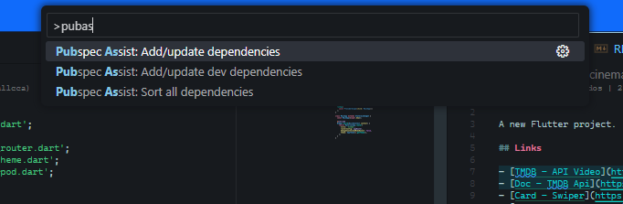

# cinemapedia

A new Flutter project.

## Levantar proyecto en local

Android SDK 34

```md
  <!-- Para instalar las dependencias sin modificar el proyecto -->
  flutter pub get --no-pub
```

1. Copiar en example.env y renombrarlo a .env
2. Cambiar las variables de entorno (the movieDb)

## Links

- [TMDB - API Video](https://www.themoviedb.org/)
- [Doc - TMDB Api](https://developer.themoviedb.org/docs/getting-started)
- [Card - Swiper](https://pub.dev/packages/card_swiper)
- [Int - Format numbers](https://pub.dev/packages/intl)

## Credentials

Para API y TOKEN

[The Movie DB](https://www.themoviedb.org/)

## Instalación de dependencias



## dependencias

> Recuerda verificar la instalación en el archivo pubspec.yaml

- Manejo de rutas: go_router
  - [Documentación](https://pub.dev/packages/go_router)
  - Ejemplo de uso en config/router/app_router.dart
- Variable de entorno: flutter_dotenv
  - [Documentación](https://pub.dev/packages/flutter_dotenv)
  - Ejemplo de uso en main.dart ln/12
- Peticiones http: dio
  - Ejemplo de uso en infrastructure/movieDb_dataSource.dart
- Controlador de estado: flutter_riverpod
  - Implementación global en main ln/15 ProviderScope
  - Ejemplo de uso en movies_repository_provider.dart

## Herramientas

- Convert JSON
  - [Quicktype.io](https://quicktype.io/)
